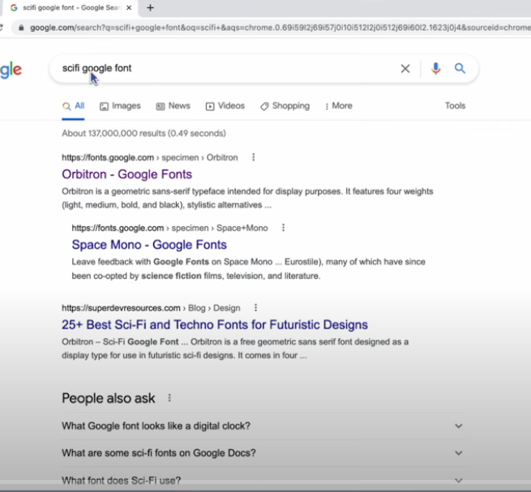

When searching for google fonts don't use the search feature inside of the fonts.google.com site search for it in the google search bar outside of the site

font-family: inherit; 
lets you inherit the font from the parent